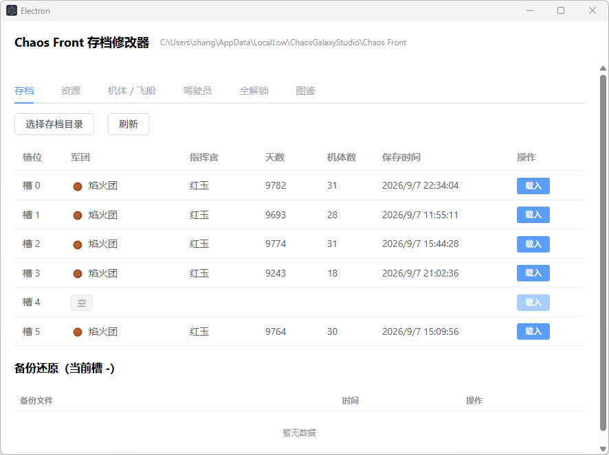
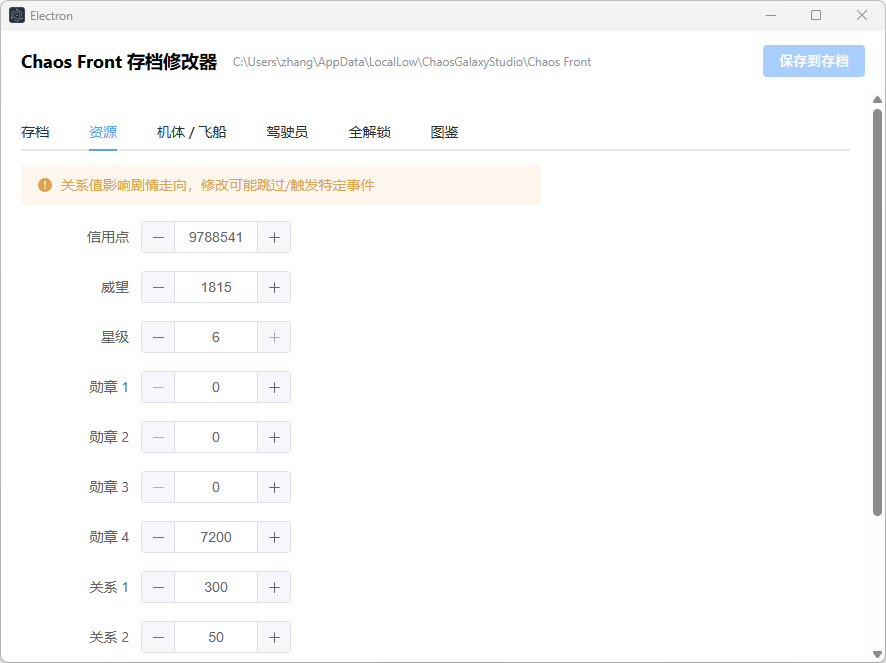
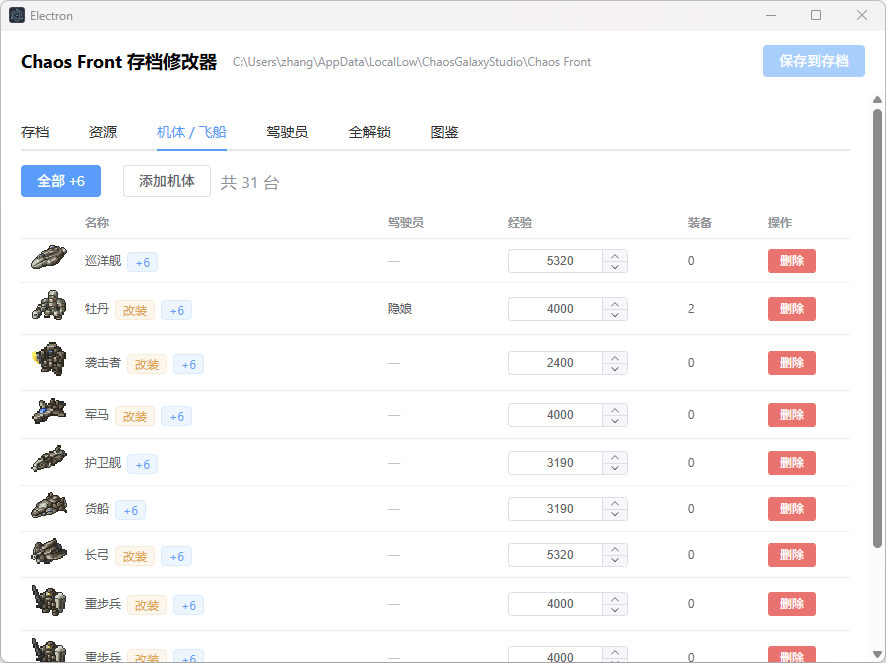
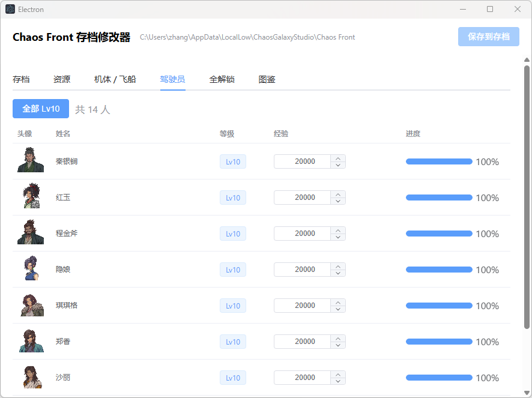
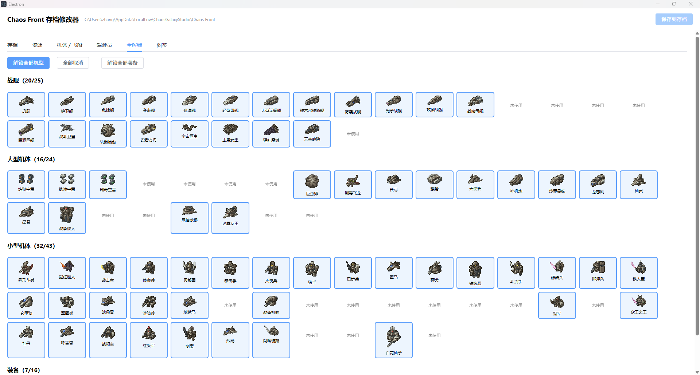
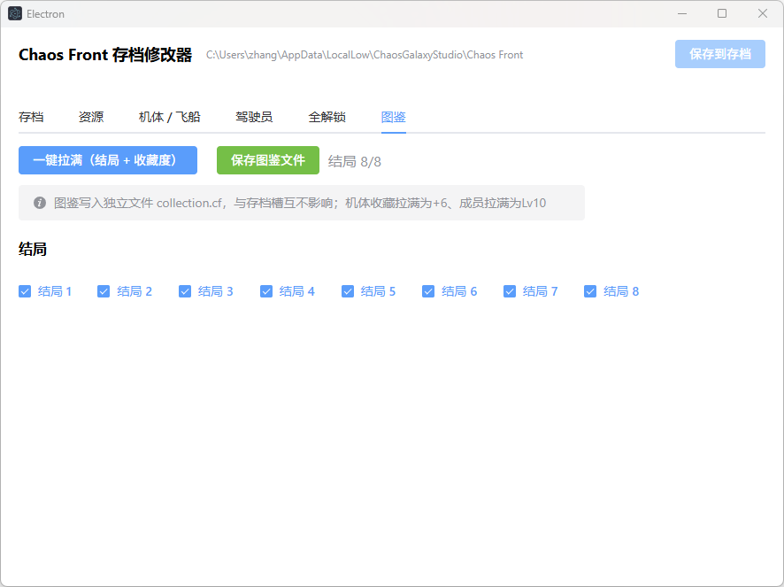

# Chaos Front Save Editor

[中文](README.md) | **English**

A Windows desktop save editor for *Chaos Front*, built with Electron. Edit resources, units, pilots, unlocks, and collection data. Every write is backed up and applied atomically.

> **Unofficial tool.** Not affiliated with, endorsed by, or associated with ChaosGalaxyStudio or the official *Chaos Front* team. For personal, offline study by players who own a legitimate copy only. Do not use online, commercially, or to distribute modified saves.

## Features

- **Saves**: Auto-detects the save folder (`%USERPROFILE%\AppData\LocalLow\ChaosGalaxyStudio\Chaos Front`), lists 6 slots (army, commander, day, unit count, save time), supports picking a folder manually; auto-backup before save (keeps last 10), restore or delete backups from the panel
- **Resources**: Credits, prestige, star rating; medals / relationships labeled with real faction names
- **Planets**: Edit economy / industry / defense / stability and owning faction (ownership changes sync `FactionData.planets`)
- **Formation**: 4×6 grid deploy / undeploy / swap, and assign pilots (one pilot cannot crew two units)
- **Units / ships**: View and edit level, XP, gear; add or remove units
- **Pilots**: View and edit level, XP, and related stats
- **Unlock all**: One-click unlock for unit types, equipment, etc.
- **Collection**: One-click fill collection / endings (`collection.cf`)

All writes follow **backup → temp file → atomic replace**. Invalid JSON is rejected so the original file is not overwritten.

## Screenshots

### Saves



### Resources



### Units / ships



### Pilots



### Unlock all



### Collection



## Download

Get the latest portable exe from [Releases](../../releases) (no installer):

- `ChaosFrontSaveEditor-<version>.exe` — Windows x64 portable

## How to use

1. **Quit the game** completely before editing (the game may overwrite saves on exit)
2. Launch the editor; it finds the save folder automatically, or use **Choose save directory**
3. On the **Saves** tab, load a slot
4. Edit other tabs, then click **Save to file**
5. Each save creates a timestamped backup under `backup/` (e.g. `savedata0_20260907_120000.cf.bak`), keeping the newest 10
6. **Restore / delete backups** from the list on the Saves tab
7. See [CHANGELOG.en.md](CHANGELOG.en.md) and [Releases](../../releases)

## Build from source

Requires Node.js 20+, npm, and Windows (win x64 target).

```bash
npm install
npm run dev
npm test
npm run dist
```

Output is under `dist/`.

## Game data extraction

Unit lists, level tables, names, and icons come from `scripts/extract-game-data.mjs` (outputs `src/common/data/game-data.json` and `src/renderer/src/assets/game/`).

**You need**: the game install (with `Chaos Front_Data`) and [AssetRipper](https://github.com/AssetRipper/AssetRipper) (free GUI build is fine).

```bash
node scripts/extract-game-data.mjs --game "path\to\Chaos Front_Data" --ripper "C:\tools\AssetRipper.GUI.Free.exe" --out .
```

- `--game` (required): path to `Chaos Front_Data`
- `--ripper`: AssetRipper executable for textures; omit for tables only (Phase 1 parses `resources.assets` directly)
- `--out`: repo root (default: current directory)
- `--export <dir>`: reuse an existing AssetRipper export (skips export; `--ripper` optional)

The script writes the JSON tables and prints counts (unit types should be 92; otherwise it exits with an error).

## Disclaimer

1. **Unofficial / no license from the publisher**: This is a third-party fan tool. It is **not** developed, sponsored, endorsed, or affiliated with ChaosGalaxyStudio or related parties.
2. **Copyright**: *Chaos Front* and all related names, trademarks, characters, units, art, data tables, audio, and text belong to **ChaosGalaxyStudio** and other rights holders. Assets in this repo are for **local reference by legitimate owners only**, do **not** include the game itself, and must not be used commercially.
3. **Allowed use**: Personal, local, **offline** study and research only. Do not use this tool or modified saves for multiplayer, competitive abuse, rental/sale, bundling, or any commercial or infringing purpose.
4. **Use at your own risk**: Editing saves may corrupt progress, break loading, or require a reinstall. Always quit the game first and rely on automatic or manual backups. **By using this tool you accept all risk**; authors and contributors are not liable for any loss.
5. **Takedown**: If a rights holder raises a reasonable request, maintainers will review and may modify, redact, or take down releases / public access.
6. **Support the official game**: Buy and play *Chaos Front* through official channels. This tool does not replace a legal copy and does not encourage piracy.

## License

[MIT](LICENSE)
